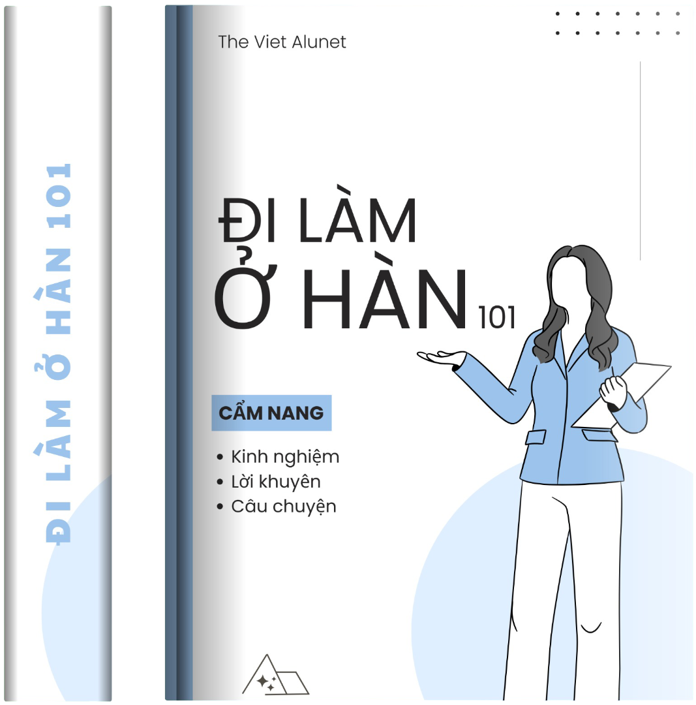

# 📘 Đi làm ở Hàn 101 – Cẩm nang thực tế cho người Việt

[](assets/img/home1-img.png)

**“Đi làm ở Hàn 101”** là một cuốn sách điện tử (Jupyter Book) được biên soạn bởi cộng đồng **The Viet ALUNET** — mạng lưới cựu sinh viên – sinh viên người Việt tại Hàn Quốc và trên toàn thế giới.

Cuốn sách này chia sẻ kinh nghiệm thực tế, lời khuyên và các case study từ những người Việt đã và đang làm việc tại Hàn Quốc.

---

## 📚 Nội dung chính

- **Bối cảnh làm việc tại Hàn Quốc**  
  Khác biệt văn hóa, hệ sinh thái công việc, các loại hình công ty phổ biến...

- **Chuẩn bị**  
  Kỹ năng tiếng Hàn, chuẩn bị CV/portfolio, thực tập, tâm lý trước khi đi làm...

- **Ứng tuyển & phỏng vấn**  
  Chiến lược tìm việc, mẹo trả lời phỏng vấn, thương lượng lương...

- **Sinh hoạt và làm việc**  
  Văn hóa công sở, xây dựng quan hệ, bảo hiểm – phúc lợi, lối sống...

- **📌 Case Studies**  
  Những câu chuyện thực tế từ cựu sinh viên FTU, NEU, UET, HUST, ULIS, HANU...

---

## 🚀 Công nghệ

Cuốn sách được xây dựng bằng [**Jupyter Book**](https://jupyterbook.org/), cho phép:

- Truy cập dễ dàng trên web, điện thoại, máy tính bảng.
- Hỗ trợ Markdown, mã nguồn, sơ đồ, nội dung tương tác.
- Dễ dàng đóng góp qua GitHub.

---

## 🧑‍💻 Đóng góp

Bạn là người Việt đang làm việc tại Hàn? Hãy chia sẻ câu chuyện của bạn!

Chúng tôi luôn chào đón:
- **Bài viết mới** (Markdown format)
- **Case Study cá nhân**
- **Kinh nghiệm tìm việc, phỏng vấn**
- **Mẹo sinh hoạt và hội nhập văn hóa**

👉 Gửi pull request hoặc liên hệ tại: [thevietalunet@gmail.com](mailto:thevietalunet@gmail.com)

---

## 🌏 Về The Viet ALUNET

> **Kết nối tri thức Việt toàn cầu**

ALUNET là mạng lưới cựu sinh viên – sinh viên từ các trường đại học hàng đầu ở Việt Nam (FTU, NEU, UET, HUST, HANU, ULIS...) và trên thế giới, cùng nhau học hỏi, hỗ trợ, phát triển nghề nghiệp và cuộc sống.

Tham gia cộng đồng tại: [https://thevietalunet.wixsite.com/home](https://thevietalunet.wixsite.com/home)

---

## 📄 Giấy phép

Nội dung cuốn sách được phát hành dưới giấy phép [**Creative Commons Attribution 4.0**](https://creativecommons.org/licenses/by/4.0/)

---

## 📦 Cách build cuốn sách

```bash
# Cài đặt jupyter-book nếu chưa có
pip install -U jupyter-book

# Build cuốn sách
jupyter-book build di-lam-o-han-101/

# Mở file HTML tại _build/html/index.html
